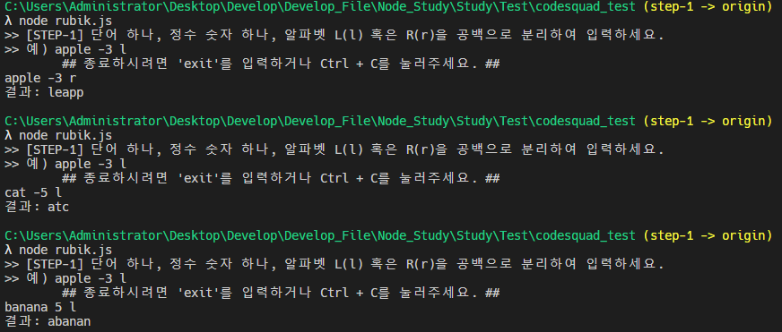
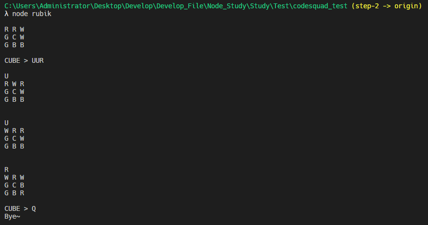
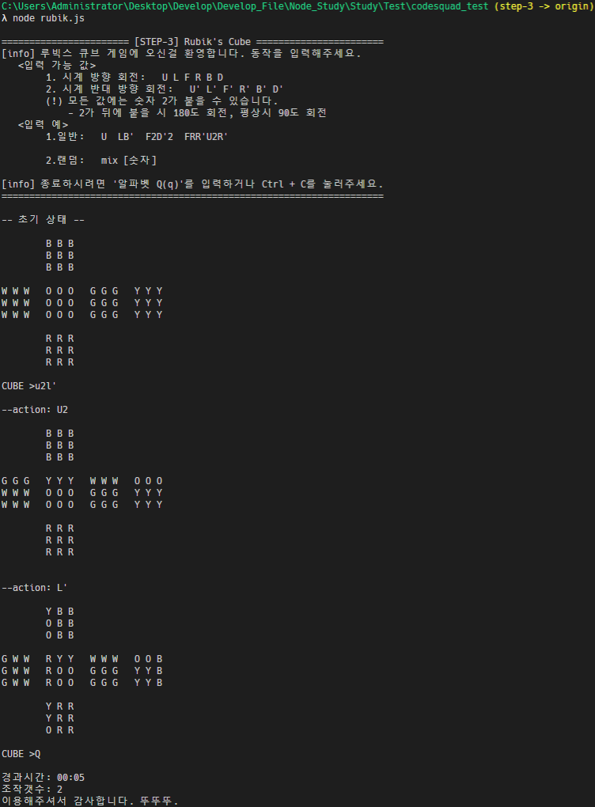

# 2021 코드스쿼드 마스터즈코스 테스트
* 실행은 되도록이면 각 Branch에서 실행해주세요!
[STEP1](https://github.com/17-sss/codesquad_test/tree/step-1) [STEP2](https://github.com/17-sss/codesquad_test/tree/step-2) [STEP3](https://github.com/17-sss/codesquad_test/tree/step-3)

## 1단계
* Node.js로 readline을 사용하여 입력을 받음.
* 입력 받은 값을 ' ' 공백을 기준으로 문자열을 배열로 변환
    * 다시 입력을 받을 경우 & 알림 메세지 출력
        * 받아온 값이 3가지가 아닌 경우 [기준단어 / 숫자(정수) / 방향]
        * 두번째 값이 정수가 아니거나 지정된 범위를 벗어날 경우         
* calcResult() 함수
    1. 받아온 기준단어를 배열로 변경
    2. 숫자와 방향에 따라 배열 내장함수( shift(), unshift(), push(), pop() )를 활용하여 구현
    3. 다시 문자열로 변경 후 최종 값 출력.
 

### 참고 이미지 및 링크

[STEP1](https://github.com/17-sss/codesquad_test/tree/step-1)

## 2단계
* Node.js로 readline을 사용하여 입력을 받음.
    * readline의 setPrompt를 사용하여 'CUBE > ' 프롬프트 문구 설정 
    readline의 prompt 사용하여 입력할 때마다 프롬프트 문구 표시
* 각종 함수들
    1. cubeState(): 큐브의 상태를 표시
    2. actionExecute(): 입력 값에 따라 큐브 제어
 

### 참고 이미지 및 링크

[STEP2](https://github.com/17-sss/codesquad_test/tree/step-2)

## 3단계
* rubik.js  (실행 파일)
    1. cubeStateView(): 큐브의 상태를 표시
    2. arrActionCreate(): 입력된 값들을 받아와서 배열화 시킨 후, 허용되는 값만 결과 값(배열)에 넣어 확정.
    3. actionEx(): arrActionCreate()에서 만든 결과 값 기준으로 큐브를 움직임. 
        - '2' 여부와 '(반시계방향) 여부 확인 후 옵션(객체값) 전달.
        - 여기서 commandFunc.js가 실행됨.
    4. randomCommand(): 가능한 모든 명령어를 랜덤으로 섞어서 실행.
        - 해당 함수 실행 명령어: mix 숫자
    5. commandSet(): 현재 작성된 명령어가 일반명령어인지 랜덤명령인지 확인 후 최종 명령 확정.
    6. calcTime(): 종료 시 경과시간을 계산하여 반환.
    7. readInput(): main, 실행용 함수 / readline을 사용하여 입력을 받아 큐브 조작 실행.    
* commandFunc.js    (큐브 동작 실행용, 모듈화)
    1. rotateArr(): 한 면이 전부 회전 시에 이 함수 실행. 
        - ex) 'U' 명령 실행 시, UP의 면이 회전할 때.
    2. executeU, executeL, executeF, executeR, executeB, executeD()
        - 동작들 (U & U' / L & L' / F & F' / R & R' / B & B' / D & D') 실행.
    3. commandFunc():  main, 실행용 함수 / 입력된 현재 명령을 체크 후, 2.번에 있는 함수 실행.
 

### 참고 이미지 및 링크

[STEP3](https://github.com/17-sss/codesquad_test/tree/step-3)

